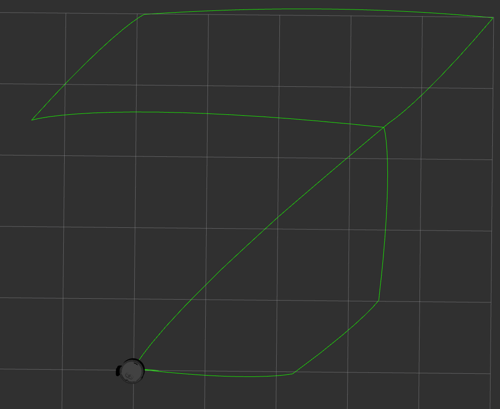

# **iRobot Create-3 Navigation Project**

## **Table of Contents**
- [Introduction](#introduction)
- [Prerequisites](#prerequisites)
- [Installation](#installation)
- [Usage](#usage)
- [Video Demonstration](#video-demonstration)
- [Nodes Description](#nodes-descritpion)
---

## **Introduction**

This project demonstrates the autonomous navigation of the iRobot Create-3 robot in a simulated environment using ROS 2 and Gazebo. The robot undocks, follows a the seven-sense logo trajectory. The top-right corner of the logo is the goal, where it then proceeds to got back to its starting location.




## **Prerequisites**

- **OS:** Ubuntu 22.04
- **ROS 2:** Humble Hawksbill
- **Python:** 3.8+
- **Packages:**
  - `irobot_create_msgs`, `irobot_create_gazebo_bringup`, `tf_transformations`, `ament_index_python`

## **Installation**

1. **Clone the Repo:**
   ```bash
   git clone https://github.com/your_username/create3_navigation.git
   ```

2. **Set Up Workspace:**
   ```bash
   mkdir -p ~/create3_ws/src
   cd ~/create3_ws/src
   git clone https://github.com/iRobotEducation/create3_sim.git -b humble
   cp -r ~/create3_navigation/create3_controller ./
   ```

3. **Install Dependencies:**
   ```bash
   cd ~/create3_ws/
   rosdep update
   rosdep install --from-paths src --ignore-src -r -y
   ```

4. **Build Workspace:**
   ```bash
   colcon build
   ```

5. **Source Workspace:**
   ```bash
   source install/setup.bash
   ```

## **Usage**

### Running the Node:

1. **Launch Simulation:**
   ```bash
   ros2 launch irobot_create_gazebo_bringup create3_gazebo.launch.py
   ```

2. **Undock the Robot:**
   ```bash
   ros2 service call /undock irobot_create_msgs/srv/Undock "{}"
   ```

3. **Run move_robot Node:**
   ```bash
   ros2 run create3_controller move_robot --ros-args -p goal_file:="/path/to/goal.yaml"
   ```

## **Video Demonstration**

Watch the robot in action: [Video Link](https://www.youtube.com/watch?v=YOUR_VIDEO_ID)


## **Nodes Description**

### move_robot Node

#### Purpose:
The `move_robot` node is responsible for moving the iRobot Create-3 robot from its starting position to a specified goal position using a predefined trajectory pattern.

#### Key Features:
- Reads the goal position from a YAML configuration file.
- Computes a series of waypoints based on a creative pattern.
- Controls the robot's linear and angular velocities to navigate through the waypoints.
- Implements simple proportional control for rotation and movement.

#### Parameters:
- `goal_file` (string): Path to the YAML file containing the goal position. Defaults to `config/goal.yaml` within the package if not specified.

#### How It Works:
1. **Initialization**:
   - Subscribes to `/odom` to receive odometry data.
   - Publishes to `/cmd_vel` to control robot velocities.
   - Reads the goal position from the YAML file.
2. **Trajectory Planning**:
   - Generates waypoints by scaling a predefined pattern with the goal position.
   - Stores the waypoints in a list to be sequentially followed.
3. **Movement Control**:
   - In each timer callback, computes the angle and distance to the next waypoint.
   - Rotates towards the waypoint if not facing it.
   - Moves forward when aligned with the waypoint.
   - Proceeds to the next waypoint upon reaching the current one.

#### Running the Node:

```bash
ros2 run create3_controller move_robot --ros-args -p goal_file:="/path/to/goal.yaml"
```
